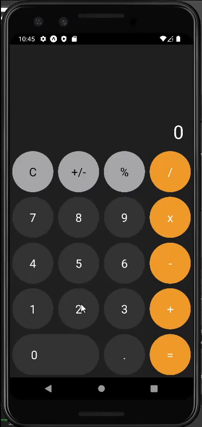
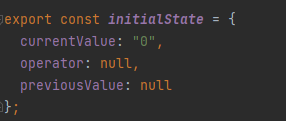
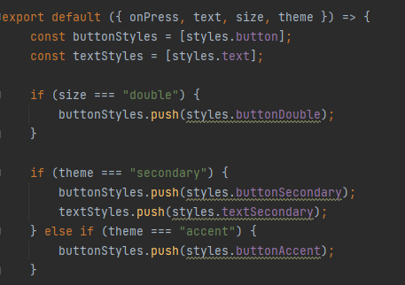
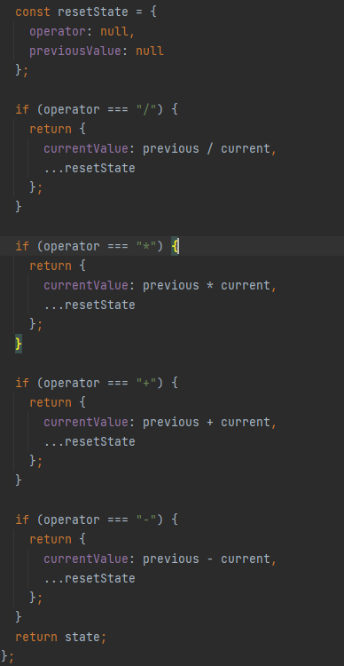
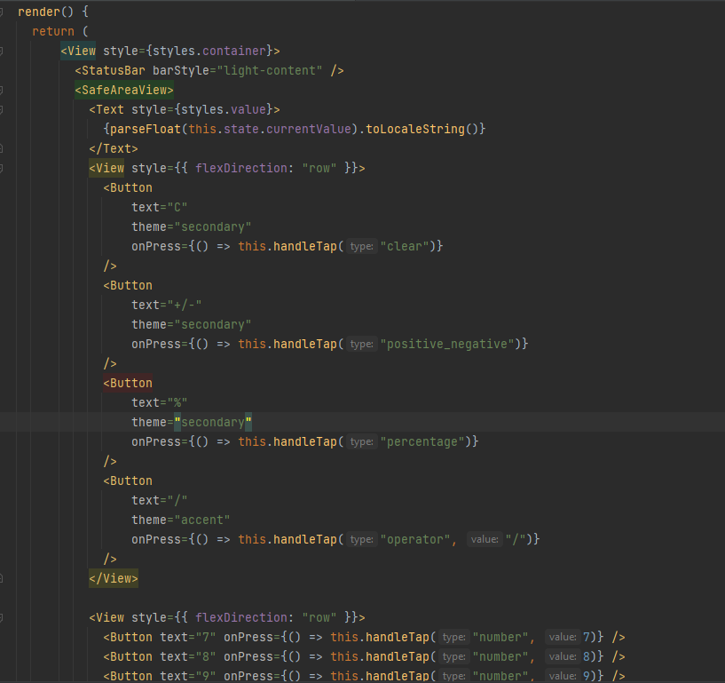
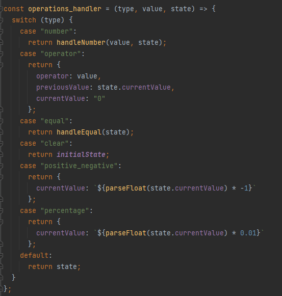

### Lab 1 - Kalkulator

Do wykonania aplikacji użyte zostały:
- React Native
- Expo
- Expo go (testowanie na fizycznym urządzeniu)
- Android Studio (Emulator Pixel 3 do testów)

Aplikacja oparta na podstawie https://reactnativeexample.com/a-simple-cross-platform-react-native-calculator/

#### Działanie aplikacji: 

#### Baza kalkulatora

Kalkulator opiera się na zmienianiu 'state', przetrzymywaniu poprzedniego stanu i operacji.

Wygląd przycisków jest wybierany z gotowych zestawów w stylesheet.

#### Operacje matematyczne

Zmiany wartości w kalkulatorze są obsługiwane za pomocą wcześniej zapisanych stanów wartości i operacji.

A same przyciski pokazane w wierszach z przypisanymi liczbami 0-9 oraz operacje 'C', '+/-', '%' oraz dodawanie, odejmowanie, mnożenie i dzielenie.

Działania/operacje przeprowadzane za pomocą switch'a gdzie wybierany jest nowy stan operacji lub liczby na podstawie wartości która trafi do switch'a.