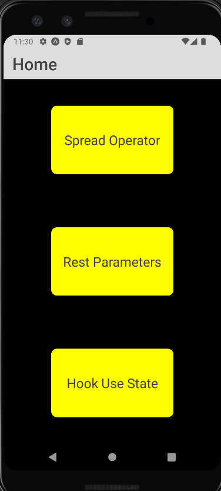
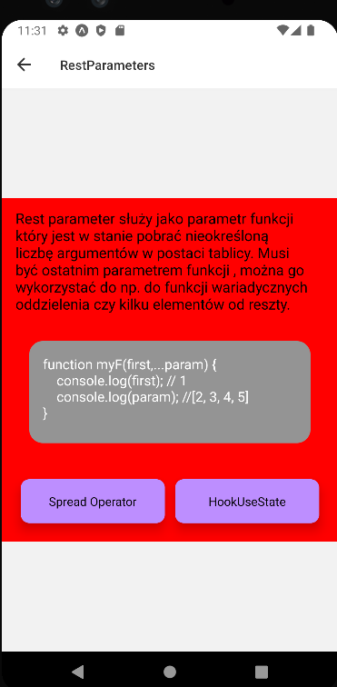
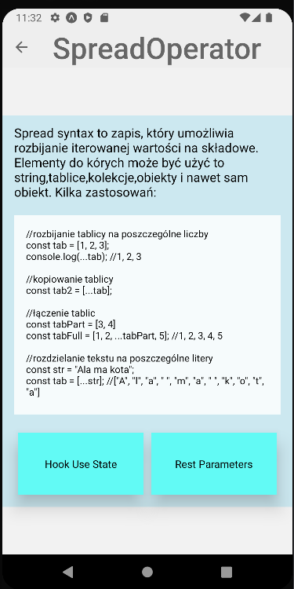
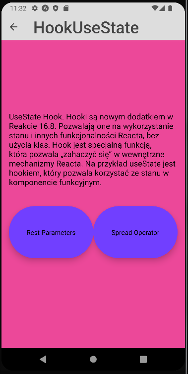

### Lab 2 - Responsywne layouty

Do wykonania aplikacji użyte zostały:
- React Native
- Expo
- Expo go (testowanie na fizycznym urządzeniu)
- Android Studio (Emulator Pixel 3 do testów)

## App.js

    import React from 'react';
    import { NavigationContainer } from '@react-navigation/native';
    import { createStackNavigator } from '@react-navigation/stack';
    import 'react-native-gesture-handler';
    import Home from './components/home';
    import RestParameters from './components/rest_parameters';
    import SpreadOperator from './components/spread_operator';
    import HookUseState from './components/hook';
    
    const Stack = createStackNavigator();
    
    function App() {
    return (
    <NavigationContainer>
    <Stack.Navigator initialRouteName="Home">
    <Stack.Screen options={{
    title: 'Home',
    headerStyle: {
    backgroundColor: '#ddd',
    },
    headerTintColor: '#444',
    headerTitleStyle: {
    fontSize: 30,
    },
    cardStyle: {
    backgroundColor: '#444',
    }
    }} name="Home" component={Home} />
    <Stack.Screen options={{
    headerStyle: {
    backgroundColor: '#fff',
    },
    headerTintColor: '#333',
    headerTitleStyle: {
    fontSize: 15,
    },
    }} name="RestParameters" component={RestParameters} />
    <Stack.Screen options={{
    headerStyle: {
    backgroundColor: '#eee',
    },
    headerTintColor: '#666',
    headerTitleStyle: {
    fontSize: 40,
    },
    }} name="SpreadOperator" component={SpreadOperator} />
    <Stack.Screen options={{
    title: 'HookUseState',
    headerStyle: {
    backgroundColor: '#ddd',
    },
    headerTintColor: '#444',
    headerTitleStyle: {
    fontSize: 35,
    },
    cardStyle: {
    backgroundColor: '#444',
    }
    }} name="HookUseState" component={HookUseState} />
    </Stack.Navigator>
    </NavigationContainer>
    );
    }
    
    export default App;

## home.js

    import * as React from 'react';
    import { View, Text, Button, TouchableOpacity  } from 'react-native';
    import styles from '../components/styles';
    
    export default function Home({navigation}) {
    return (
    <View style={styles.home.Container}>
    <TouchableOpacity style={styles.home.Button}  onPress={() => navigation.navigate('SpreadOperator')} >
    <Text style={styles.home.Text}>Spread Operator</Text>
    </TouchableOpacity>
    <TouchableOpacity style={styles.home.Button}   onPress={() => navigation.navigate('RestParameters')} >
    <Text style={styles.home.Text}>Rest Parameters</Text>
    </TouchableOpacity>
    <TouchableOpacity style={styles.home.Button} onPress={() => navigation.navigate('HookUseState')} >
    <Text style={styles.home.Text}>Hook Use State</Text>
    </TouchableOpacity>
    </View>
    );
    }

## rest_parameters.js

    import * as React from 'react';
    import { View, Text, Button, TouchableOpacity  } from 'react-native';
    import styles from '../components/styles';
    
    export default function RestParameters({navigation}) {
    return (
    <View style = {styles.restParameters.Container}>
    <Text style = {styles.restParameters.Text}>Rest parameter służy jako parametr funkcji który jest w stanie pobrać nieokreśloną liczbę argumentów w postaci tablicy. Musi być ostatnim parametrem funkcji , można go wykorzystać do np. do funkcji wariadycznych oddzielenia czy kilku elementów od reszty.</Text>
    <View style = {styles.restParameters.Ex}>
    <Text style = {styles.restParameters.TextEx} >{
    `function myF(first,...param) {
    console.log(first); // 1
    console.log(param); //[2, 3, 4, 5]
    }
    
    myF(1,2,3,4,5);`
    }</Text>
    </View>
    <View style={styles.restParameters.Buttons} >
    <TouchableOpacity style={styles.restParameters.Button} onPress={() => navigation.navigate('HookUseState')} >
    <Text>HookUseState</Text>
    </TouchableOpacity>
    <TouchableOpacity style={styles.restParameters.Button} onPress={() => navigation.navigate('SpreadOperator')} >
    <Text>Spread Operator</Text>
    </TouchableOpacity>
    </View>
    </View>
    );
    }

## spread_operator.js

    import * as React from 'react';
    import { View, Text, Button, TouchableOpacity  } from 'react-native';
    import styles from '../components/styles';
    
    export default function SpreadOperator({navigation}) {
    return (
    <View style = {styles.spreadOperator.Container}>
    <Text style = {styles.spreadOperator.Text}>Spread syntax to zapis, który umożliwia rozbijanie iterowanej wartości na składowe. Elementy do kórych może być użyć to string,tablice,kolekcje,obiekty i nawet sam obiekt.
    Kilka zastosowań:
    </Text>
    <View style = {styles.spreadOperator.Ex}>
    <Text style = {styles.spreadOperator.TextEx}>{
    `//rozbijanie tablicy na poszczególne liczby
    const tab = [1, 2, 3];
    console.log(...tab); //1, 2, 3
    
    //kopiowanie tablicy
    const tab2 = [...tab];
    
    //łączenie tablic
    const tabPart = [3, 4]
    const tabFull = [1, 2, ...tabPart, 5]; //1, 2, 3, 4, 5
    
    //rozdzielanie tekstu na poszczególne litery
    const str = "Ala ma kota";
    const tab = [...str]; //["A", "l", "a", " ", "m", "a", " ", "k", "o", "t", "a"]
    
    //Można też stosować do Math.max która wymaga parametrów po przecinku
    const tab = [1, 2, 3, 5, 4];
    Math.max(...tab); //5`
    }</Text>
    </View>
    <View  style={styles.spreadOperator.Buttons}>
    <TouchableOpacity style={styles.spreadOperator.Button} onPress={() => navigation.navigate('HookUseState')} >
    <Text>Hook Use State</Text>
    </TouchableOpacity>
    <TouchableOpacity style={styles.spreadOperator.Button} onPress={() => navigation.navigate('RestParameters')} >
    <Text>Rest Parameters</Text>
    </TouchableOpacity>
    </View>
    </View>
    );
    }

## hook.js

    import * as React from 'react';
    import { View, Text, Button, TouchableOpacity  } from 'react-native';
    import styles from '../components/styles';
    
    export default function HookUseState({navigation}) {
    return (
    <View style = {styles.hookUseState.Container}>
    <Text style = {styles.hookUseState.Text}>UseState Hook. Hooki są nowym dodatkiem w Reakcie 16.8. Pozwalają one na wykorzystanie stanu i innych funkcjonalności Reacta, bez użycia klas. Hook jest specjalną funkcją, która pozwala „zahaczyć się” w wewnętrzne mechanizmy Reacta. Na przykład useState jest hookiem, który pozwala korzystać ze stanu w komponencie funkcyjnym.</Text>
    <View style={styles.hookUseState.Buttons}>
    <TouchableOpacity style={styles.hookUseState.Button}  onPress={() => navigation.navigate('RestParameters')} >
    <Text>Rest Parameters</Text>
    </TouchableOpacity>
    <TouchableOpacity style={styles.hookUseState.Button} onPress={() => navigation.navigate('SpreadOperator')} >
    <Text>Spread Operator</Text>
    </TouchableOpacity>
    </View>
    </View>
    
        );
    }

### Wszystkie style zostały umieszczone w pliku styles.js:

    import { StyleSheet } from 'react-native';

    const styles = {}
    styles.home = StyleSheet.create({
    Container: {
    flex: 1,
    alignItems: 'stretch',
    justifyContent: 'center',
    backgroundColor: '#000',
    },
    Button: {
    flex: 1,
    backgroundColor: '#ff0',
    alignItems: 'center',
    justifyContent: 'center',
    marginHorizontal: 86,
    marginVertical: 48,
    borderRadius:10,
    },
    Text: {
    color:'#444',
    fontSize:24,
    },
    });
    
    styles.hookUseState = StyleSheet.create({
    Container: {
    flex: 1,
    backgroundColor: '#ec4899',
    alignItems: 'stretch',
    justifyContent: 'center',
    textAlign : 'center',
    paddingHorizontal: 16,
    paddingVertical: 12,
    },
    Text: {
    color:'#000',
    fontSize:17,
    },
    Ex: {
    flex: 1,
    backgroundColor: '#444',
    justifyContent: 'center',
    marginHorizontal: 16,
    marginVertical: 15,
    paddingHorizontal: 25,
    paddingVertical: 25,
    borderRadius: 8,
    fontSize: 24,
    },
    Buttons: {
    flexDirection: 'row',
    },
    Button: {
    flex: 1,
    backgroundColor: '#713FFF',
    alignItems: 'center',
    justifyContent: 'center',
    marginVertical: 40,
    paddingVertical: 46,
    borderRadius:80,
    elevation: 10,
    }
    });
    styles.restParameters = StyleSheet.create({
    Container: {
    flex: 1,
    backgroundColor: '#f00',
    alignItems: 'stretch',
    justifyContent: 'center',
    marginVertical:128,
    textAlign : 'center',
    paddingHorizontal: 16,
    paddingVertical: 12,
    },
    Text: {
    color:'#000',
    fontSize:17,
    },
    TextEx: {
    color:'#fff',
    fontSize:16,
    },
    Ex: {
    flex: 1,
    backgroundColor: '#949494',
    justifyContent: 'center',
    marginHorizontal: 16,
    marginVertical: 32,
    paddingHorizontal:16,
    paddingVertical:16,
    borderRadius:16,
    fontSize:36,
    },
    Buttons: {
    flexDirection: 'row-reverse',
    },
    Button: {
    flex: 1,
    backgroundColor: '#BD8EFF',
    alignItems: 'center',
    justifyContent: 'center',
    marginHorizontal: 6,
    marginVertical: 10,
    paddingVertical: 16,
    borderRadius:10,
    elevation: 10,
    },
    });
    styles.spreadOperator = StyleSheet.create({
    Container: {
    flex: 1,
    backgroundColor: '#CCE8F0',
    alignItems: 'stretch',
    justifyContent: 'center',
    marginVertical:64,
    textAlign : 'center',
    paddingHorizontal: 16,
    paddingVertical: 12,
    },
    Text: {
    color:'#000',
    fontSize:17,
    },
    TextEx: {
    color:'#000',
    fontSize:13,
    },
    Ex: {
    flex: 1,
    backgroundColor: '#F6FBFC',
    justifyContent: 'center',
    marginVertical: 20,
    paddingHorizontal:16,
    paddingVertical:16,
    fontSize:24,
    },
    Buttons: {
    flexDirection: 'row',
    },
    Button: {
    flex: 1,
    backgroundColor: '#62FAF5',
    alignItems: 'center',
    justifyContent: 'center',
    marginHorizontal: 5,
    marginVertical: 5,
    paddingVertical: 32,
    elevation: 18,
    }
    });
    
    
    export default styles
