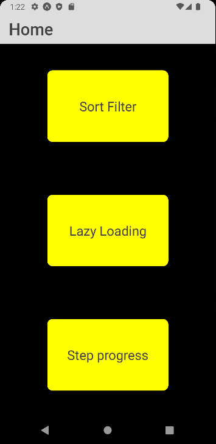
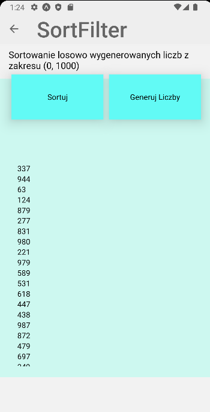
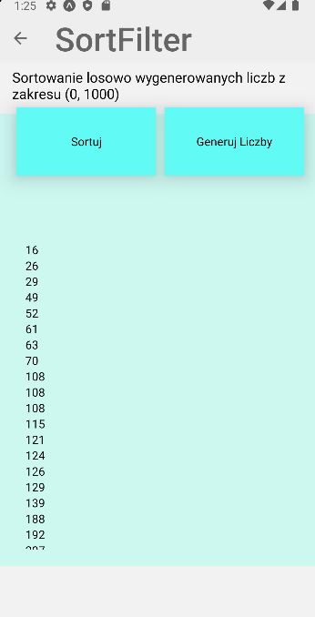
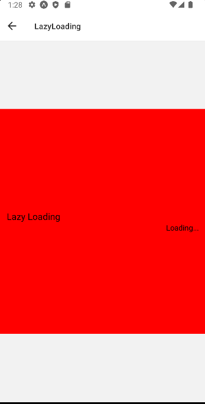
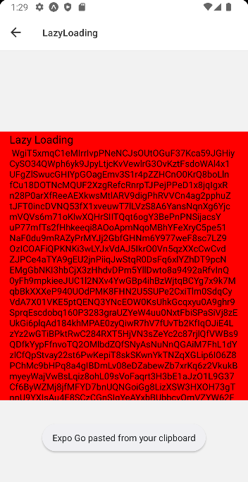
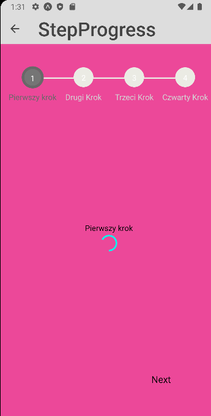
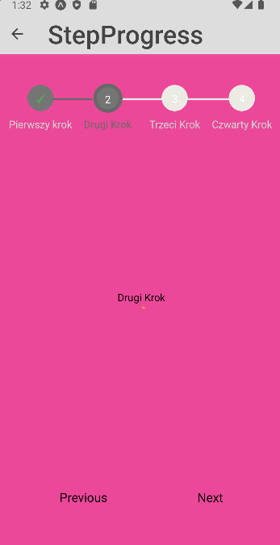
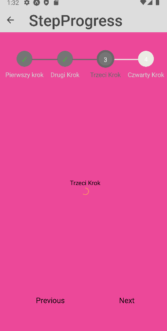
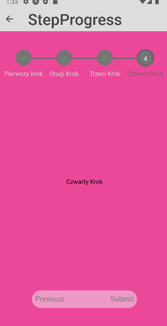
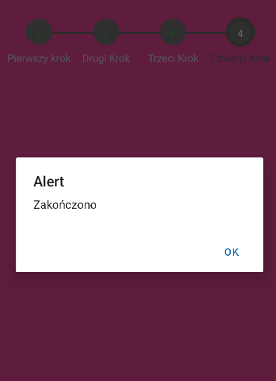

### Lab 3 - Renderowane listy

Do wykonania aplikacji użyte zostały:
- React Native
- Expo
- Expo go (testowanie na fizycznym urządzeniu)
- Android Studio (Emulator Pixel 3 do testów)
- Kod z poprzedniej aplikacji 

## home.js

    export default function Home({navigation}) {
    return (
        <View style={styles.home.Container}>
            <TouchableOpacity style={styles.home.Button}  onPress={() => navigation.navigate('SortFilter')} >
                <Text style={styles.home.Text}>Sort Filter</Text>
            </TouchableOpacity>
            <TouchableOpacity style={styles.home.Button}   onPress={() => navigation.navigate('LazyLoading')} >
                <Text style={styles.home.Text}>Lazy Loading</Text>
            </TouchableOpacity>
            <TouchableOpacity style={styles.home.Button} onPress={() => navigation.navigate('StepProgress')} >
                <Text style={styles.home.Text}>Step progress</Text>
            </TouchableOpacity>
        </View>
    );

## sort_filter.js

### Po sortowaniu:

        const Numbers = ({ liczby }) => {
        var index = 0
        return (
            <ScrollView >
                {liczby.map(liczba => <Text key={index++} >{liczba}</Text>)}
            </ScrollView>
        );
    };
    
    export default class SortFilter extends Component{
    constructor(){
    super();
    const arr = [];
    const sorted = false;
    for (let i = 0; i < 100; i++) {
    arr.push(Math.floor(Math.random() * 1000) + 1);
    }
    this.state = {
    arr
    };
    }
    sort = () =>{
    if(!this.state.sorted){
    this.state.arr.sort((a,b) => a > b ? 1:-1)
    this.state.sorted = true
    }
    else {
    this.state.arr.sort((a,b) => a > b ? -1:1)
    this.state.sorted = false
    }
    this.forceUpdate()
    }
    generate_numbers = () =>{
    const newarr = []
    for (let i = 0; i < this.state.arr.length; i++) {
    newarr.push(Math.floor(Math.random() * 1000) + 1);
    }
    this.state.arr = newarr
    this.state.sorted = false
    this.forceUpdate()
    }
    
        render(){
            return (
                <View style={styles.sortFilter.Container}>
                        <View >
                            <Text style={styles.sortFilter.Text}>Sortowanie losowo wygenerowanych liczb z zakresu (0, 1000)</Text>
                        </View>
                        <View style={styles.sortFilter.Buttons}>
                            <TouchableOpacity style={styles.sortFilter.Button}  onPress={this.sort}>
                                <Text >Sortuj</Text>
                            </TouchableOpacity>
                            <TouchableOpacity style={styles.sortFilter.Button} onPress={this.generate_numbers}>
                                <Text >Generuj Liczby</Text>
                            </TouchableOpacity>
                        </View>
                    <View style={styles.sortFilter.TextEx} >
                        <Numbers  liczby={this.state.arr} />
                    </View>
                </View>
            )
        };
    }

## characters_generator.js
#### Komponent potrzebny do generowania liter w lazy_loading

    constructor(props){
        super(props)

        const length = props.length ? props.length : 0

        const characters ='ABCDEFGHIJKLMNOPQRSTUVWXYZabcdefghijklmnopqrstuvwxyz0123456789';
        let load = ' ';
        const charactersLength = characters.length;
        for ( let i = 0; i < length; i++ ) {
            load += characters.charAt(Math.floor(Math.random() * charactersLength));
        }

        this.state = { text: load }
    }
    render(){
        return (
            <ScrollView>
                <Text>{this.state.text}</Text>
            </ScrollView>
        )
    };

## lazy_loading.js

    const Lazy = React.lazy(() => import('./characters_generator'))
    
    export default class LazyLoading extends Component {
    render(){
    return (
    <View style = {styles.restParameters.Container}>
    <View >
    <Text style = {styles.restParameters.Text}>Lazy Loading</Text>
    </View>
    <View style={styles.restParameters.Buttons} >
    <Suspense fallback={<Text>Loading...</Text>}>
    <Lazy length="99999"/>
    </Suspense>
    </View>
    </View>
    );
    }
    }

## step_progress.js

    defaultScrollViewProps = {
        keyboardShouldPersistTaps: 'handled',
        contentContainerStyle: {
            flex: 1,
            justifyContent: 'center'
        }
    };

    onStepComplete = () => {
        alert('Zakończono');
    };
    render(){
        const progressStepsStyle = {
            activeStepIconBorderColor: '#686868',
            activeLabelColor: '#686868',
            activeStepNumColor: 'white',
            activeStepIconColor: '#757575',
            completedStepIconColor: '#757575',
            completedProgressBarColor: '#686868',
            completedCheckColor: '#4bb543'
        };

        const buttonTextStyle = {
            color: '#686868',
            fontWeight: 'bold'
        };
        return (
            <View style = {styles.hookUseState.Container}>
                <ProgressSteps {...progressStepsStyle}>
                    <ProgressStep
                        label="Pierwszy krok"
                        scrollViewProps={this.defaultScrollViewProps}
                        nextBtnTextStyle={styles.hookUseState.Text}
                        previousBtnTextStyle={styles.hookUseState.Text}
                    >
                        <View style={{ alignItems: 'center' }}>
                            <Text>Pierwszy krok</Text>
                            <View style={[styles.container, styles.horizontal]}>

                                <ActivityIndicator size="large" color="#03fcf0" />
                            </View>

                        </View>
                    </ProgressStep>
                    <ProgressStep
                        label="Drugi Krok"
                        scrollViewProps={this.defaultScrollViewProps}
                        nextBtnTextStyle={styles.hookUseState.Text}
                        previousBtnTextStyle={styles.hookUseState.Text}
                    >
                        <View style={{ alignItems: 'center' }}>
                            <Text>Drugi Krok</Text>
                            <View style={[styles.container, styles.horizontal]}>

                                <ActivityIndicator size="large" color="#fc9931" />
                            </View>
                        </View>
                    </ProgressStep>
                    <ProgressStep
                        label="Trzeci Krok"
                        scrollViewProps={this.defaultScrollViewProps}
                        nextBtnTextStyle={styles.hookUseState.Text}
                        previousBtnTextStyle={styles.hookUseState.Text}
                    >
                        <View style={{ alignItems: 'center' }}>
                            <Text>Trzeci Krok</Text>
                            <View style={[styles.container, styles.horizontal]}>

                                <ActivityIndicator size="small" color="#fc9067" />
                            </View>
                        </View>
                    </ProgressStep>
                    <ProgressStep
                        label="Czwarty Krok"
                        FinishBtnText={'Zakończ'}
                        onSubmit={this.onStepComplete}
                        scrollViewProps={this.defaultScrollViewProps}
                        nextBtnTextStyle={styles.hookUseState.Text}
                        previousBtnTextStyle={styles.hookUseState.Text}
                    >
                        <View style={{ alignItems: 'center' }}>
                            <Text>Czwarty Krok</Text>
                            <View style={[styles.container, styles.horizontal]}>

                                <ActivityIndicator size="small" color="#fc5578" />
                            </View>
                        </View>
                    </ProgressStep>
                </ProgressSteps>
            </View>
        );

