### Lab 4 - Obsługa danych

Do wykonania aplikacji użyte zostały:
- React Native
- Expo
- Expo go (testowanie na fizycznym urządzeniu)
- Android Studio (Emulator Pixel 3 do testów)
- Kod z poprzedniej aplikacji 

## home.js
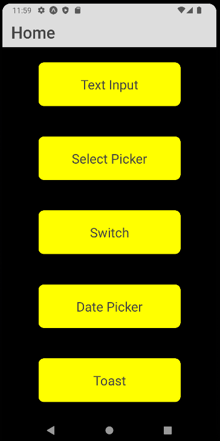

    export default function Home({navigation}) {
    return (
        <View style={styles.home.Container}>
            <TouchableOpacity style={styles.home.Button}  onPress={() => navigation.navigate('TextInput')} >
                <Text style={styles.home.Text}>Text Input</Text>
            </TouchableOpacity>
            <TouchableOpacity style={styles.home.Button}   onPress={() => navigation.navigate('SelectPicker')} >
                <Text style={styles.home.Text}>Select Picker</Text>
            </TouchableOpacity>
            <TouchableOpacity style={styles.home.Button} onPress={() => navigation.navigate('Switch')} >
                <Text style={styles.home.Text}>Switch</Text>
            </TouchableOpacity>
            <TouchableOpacity style={styles.home.Button} onPress={() => navigation.navigate('DatePicker')} >
                <Text style={styles.home.Text}>Date Picker</Text>
            </TouchableOpacity>
            <TouchableOpacity style={styles.home.Button} onPress={() => navigation.navigate('ActiveToast')} >
                <Text style={styles.home.Text}>Toast</Text>
            </TouchableOpacity>
        </View>
    );

## Text Input

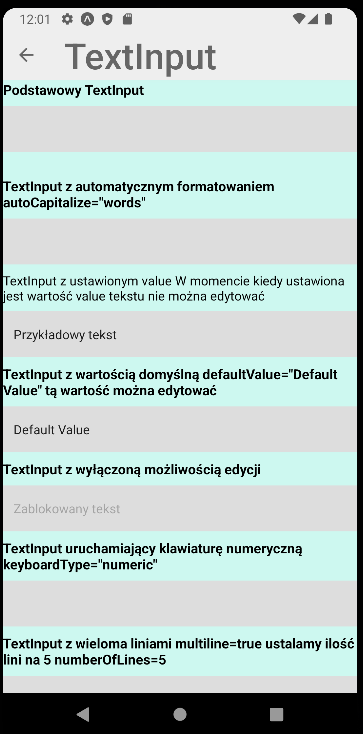
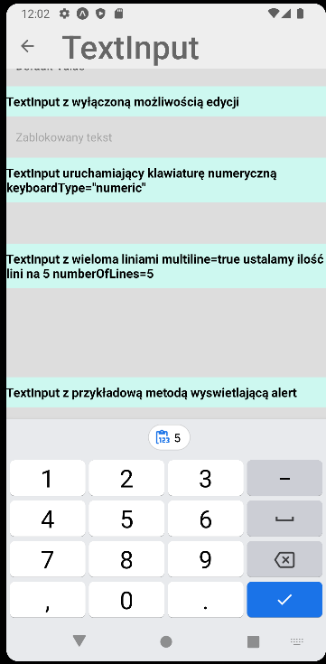
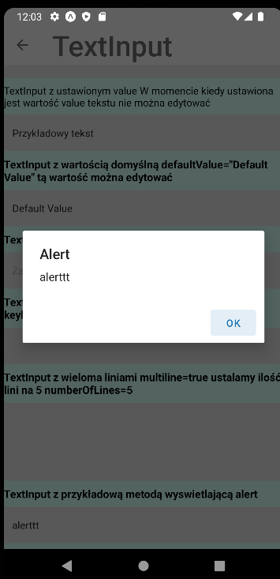

    export default class Text_Input extends Component{
    render(){
        return (
            <View>
                <ScrollView >
                    <View style={styles.sortFilter.Container}>
                        <Text style={styles.sortFilter.text}>Podstawowy TextInput</Text>
                        <TextInput style={styles.sortFilter.input} /><Text/>
                    </View>
                    <View style={styles.sortFilter.Container}>
                        <Text style={styles.sortFilter.text}>TextInput z automatycznym formatowaniem autoCapitalize="words"</Text>
                        <TextInput style={styles.sortFilter.input} autoCapitalize="words" />
                    </View>
                    <View style={styles.sortFilter.Container}>
                        <Text >TextInput z ustawionym value W momencie kiedy ustawiona jest wartość value tekstu nie można edytować</Text>
                        <TextInput style={styles.sortFilter.input} value="Przykładowy tekst" />
                    </View>
                    <View style={styles.sortFilter.Container}>
                        <Text style={styles.sortFilter.text}>TextInput z wartością domyślną defaultValue="Default Value" tą wartość można edytować</Text>
                        <TextInput style={styles.sortFilter.input} defaultValue="Default Value" />
                    </View>
                    <View style={styles.sortFilter.Container}>
                        <Text style={styles.sortFilter.text}>TextInput z wyłączoną możliwością edycji</Text>
                        <TextInput style={styles.sortFilter.input} editable={false} value="Zablokowany tekst" />
                    </View>
                    <View style={styles.sortFilter.Container}>
                        <Text style={styles.sortFilter.text}>TextInput uruchamiający klawiaturę numeryczną keyboardType="numeric"</Text>
                        <TextInput style={styles.sortFilter.input} keyboardType="numeric" />
                    </View>

                    <View style={styles.sortFilter.Container}>
                        <Text style={styles.sortFilter.text}>TextInput z wieloma liniami multiline=true ustalamy ilość lini na 5 numberOfLines=5</Text>
                        <TextInput style={styles.sortFilter.input} multiline={true} numberOfLines={5}/>
                    </View>
                    <View style={styles.sortFilter.Container}>
                        <Text style={styles.sortFilter.text}>TextInput z przykładową metodą wyswietlającą alert</Text>
                        <TextInput style={styles.sortFilter.input} onEndEditing={event =>{alert(event.nativeEvent.text)}} />
                    </View>
                </ScrollView>
            </View>
        )
    };

## Select Picker
#### select.js

    export default function Select(props) {
    return (
        <View>
            <Text style={styles.SelectPICK.pickerLabel}>{props.label}</Text>
            <Picker {...props}>
                {props.items.map(i => (
                    <Picker.Item key={i.label} {...i} />
                ))}
            </Picker>
        </View>
    );
    }
    Select.propTypes = {
    items: PropTypes.array,
    };

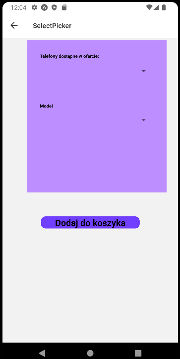
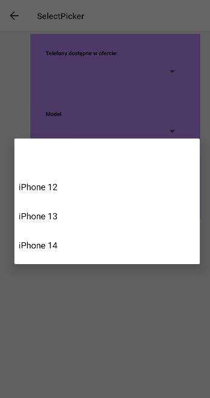
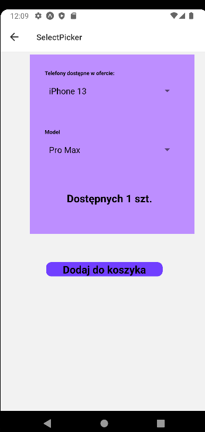
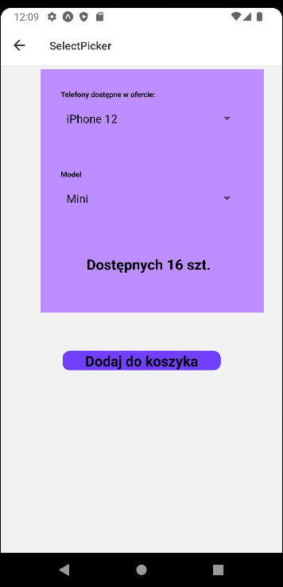

    export default function SelectPicker() {
    const [urzadzenia, setUrzadzenia] = useState([
        { label: "", value: "" },
        { label: "iPhone 12", value: "iPhone 12" },
        { label: "iPhone 13", value: "iPhone 13" },
        { label: "iPhone 14", value: "iPhone 14" },
    ]);
    const [dostepne, setDostepne] = useState([
        { label: "", value: null, urzadzenia: ["iPhone 12", "iPhone 13", "iPhone 14"] },
        { label: "Mini", value: 16, urzadzenia: ["iPhone 12"] },
        { label: "Max", value: 3, urzadzenia: ["iPhone 12"] },
        { label: "Pro Max", value: 2, urzadzenia: ["iPhone 12"] },
        { label: "Mini", value: 15, urzadzenia: ["iPhone 13"] },
        { label: "Pro Max", value: 1, urzadzenia: ["iPhone 13"] },
        { label: "Pro", value: 1, urzadzenia: ["iPhone 14"] }
    ]);
    const [availableDostepne, setAvailableDostepne] = useState([]);
    const [selectedUrzadzenie, setSelectedUrzadzenie] = useState(null);
    const [selectedDostepny, setSelectedDostepny] = useState(null);
    const [selection, setSelection] = useState("");
    return (
        <View style={styles.SelectPICK.container}>
            <View style={styles.SelectPICK.pickerContainer}>
                <View style={styles.SelectPICK.selectContainer}>
                    <Select
                        label="Telefony dostępne w ofercie:"
                        items={urzadzenia}
                        selectedValue={selectedUrzadzenie}
                        onValueChange={urzadzenie => {
                            setSelectedUrzadzenie(urzadzenie);
                            setSelectedDostepny(null);
                            setAvailableDostepne(dostepne.filter(i =>
                                i.urzadzenia.includes(urzadzenie)));
                        }}
                    />
                </View>
                <View style={styles.SelectPICK.selectContainer}>
                    <Select
                        label="Model"
                        items={availableDostepne}
                        selectedValue={selectedDostepny}
                        onValueChange={dostepny => {
                            setSelectedDostepny(dostepny);
                            setSelection(
                                ` Dostępnych ${dostepne.find(i => i.value ===
                                    dostepny).value} szt.`
                            );
                        }}
                    />
                </View>
                <View style={styles.SelectPICK.selectionContainer}>
                    <Text style={styles.SelectPICK.selection}>{selection}</Text>
                </View>
            </View>
            <TouchableOpacity style={styles.SelectPICK.Button} >
                <Text style={styles.SelectPICK.selection}>Dodaj do koszyka</Text>
            </TouchableOpacity>
        </View>
    );

## Switch
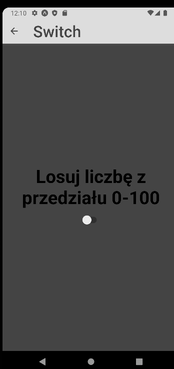
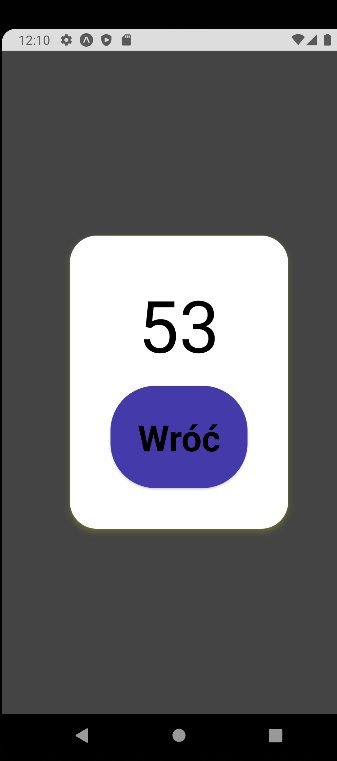

    export default class SwitchScreen extends Component {state = {
    modalVisible: false
    };

    setModalVisible = (visible) => {
        this.setState({ modalVisible: visible });
    }

    render() {
        const { modalVisible } = this.state;
        return (
            <View style={styles.SwitchScr.centeredView}>
                <Modal
                    animationType="slide"
                    transparent={true}
                    visible={modalVisible}
                    onRequestClose={() => {
                        this.setModalVisible(!modalVisible);
                    }}
                >
                    <View style={styles.SwitchScr.centeredView}>
                        <View style={styles.SwitchScr.modalView}>
                            <Text style={styles.SwitchScr.modalText}>{Math.floor(Math.random()*100)}</Text>
                            <Pressable
                                style={styles.SwitchScr.button}
                                onPress={() => this.setModalVisible(!modalVisible)}
                            >
                                <Text style={styles.SwitchScr.textStyle}>Wróć</Text>
                            </Pressable>
                        </View>
                    </View>
                </Modal>
                <Text style={styles.SwitchScr.textStyle}>Losuj liczbę z przedziału 0-100</Text>
                <Switch value={modalVisible} onValueChange={() => this.setModalVisible(true)}/>
            </View>
        );
    }

## Date Picker

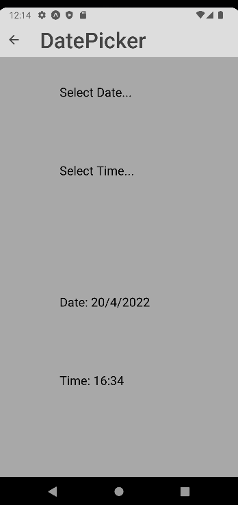
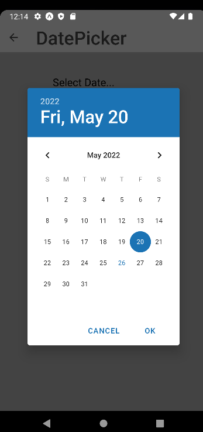
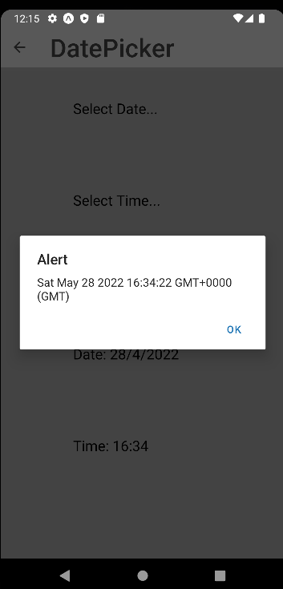
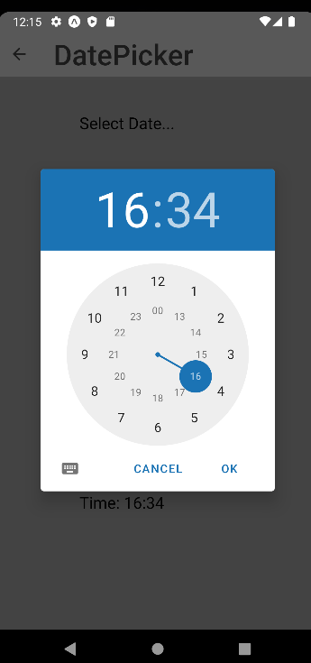
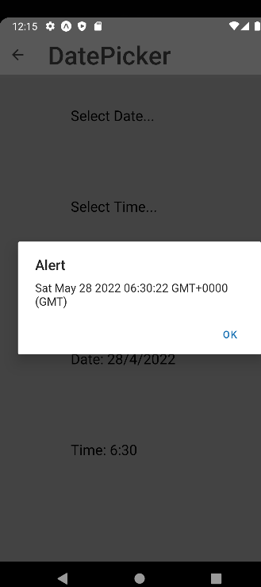

    const [date, setDate] = useState(new Date("May 20, 2022 16:34:22"));
    const [mode, setMode] = useState('date');
    const [show, setShow] = useState(false);
    const B = (props) => <Text style={{fontWeight: 'bold',color:'black'}}>{props.children}</Text>

    const onChange = (event, selectedDate) => {
        const currentDate = selectedDate || date;
        setShow(Platform.OS === 'ios');
        setDate(currentDate);
        alert(currentDate);
    };

    const showMode = (currentMode) => {
        setShow(true);
        setMode(currentMode);
    };

    const showDatepicker = () => {
        showMode('date');
    };

    const showTimepicker = () => {
        showMode('time');
    };

    return (
        <>
            <View style={styles.DatePicker.homeContainer}>
                <TouchableOpacity  onPress={showDatepicker}>
                    <Text style={styles.DatePicker.text}>
                        Select Date...
                    </Text>
                </TouchableOpacity>
                <TouchableOpacity  onPress={showTimepicker}>
                    <Text style={styles.DatePicker.text}>
                        Select Time...
                    </Text>
                </TouchableOpacity>
            </View>
            {show && (
                <DateTimePicker
                    testID="dateTimePicker"
                    value={date}
                    mode={mode}
                    is24Hour={true}
                    display="default"
                    onChange={onChange}
                />
            )}
            <View style={styles.DatePicker.homeContainer}>
                <Text style={styles.DatePicker.text}>Date: {date.getDate()}/{date.getMonth()}/{date.getFullYear()}</Text>
                <Text style={styles.DatePicker.text}>Time: {date.getHours()}:{date.getMinutes()}</Text>
            </View>
        </>
    );

## Atkywny modal + ToastAndroid

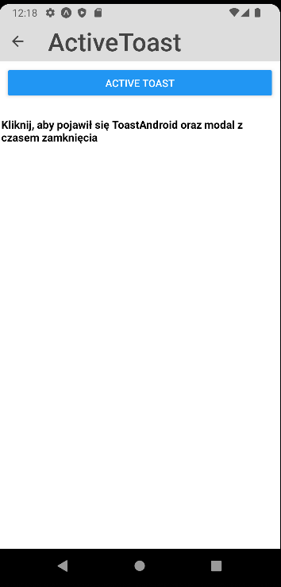
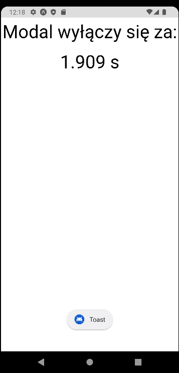
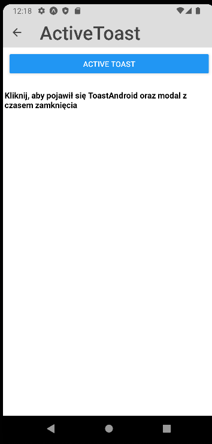

    const Toast = ({ visible}) => {
    if (visible) {
        ToastAndroid.showWithGravityAndOffset(
            "Toast",
            ToastAndroid.LONG,
            ToastAndroid.CENTER,
            25,
            50
        );
    }
    return null;
    };
    
    const ToastButton = () => {
    const [visible, setvisible] = React.useState(false);
    const [switchOn, setswitchOn] = React.useState(false);
    const [time, setTime] = useState(0);

    useEffect(() => setvisible(false), [visible]);

    const handleButtonPress = () => {
        setvisible(true);
    };

    const onToggleSwitch = () => {
        setswitchOn(!switchOn);
    };

    var promise = null
    const createPromise = () => {
        let time = Math.floor(Math.random()*10000)
        setTime(time)
        promise = new Promise((resolve, reject) => {
            setTimeout(() => {
                resolve('ukryj');
            }, time);
        });
    }

    return (
        <View style={styles.Toast.modalContainer}>
            <Toast visible={visible} />
            <Button title="Active Toast" onPress={() => {
                onToggleSwitch()
                handleButtonPress()
                createPromise()
                promise.then((value) => {
                    if(value == 'ukryj'){
                        setswitchOn(false)
                    }
                });
            }}/>
            <Modal
                animationType="fade"
                transparent={false}
                visible={switchOn}
                onRequestClose={() => {
                    setModalVisible(!switchOn);
                }}
            >
                <View >
                    <View >
                        <Text onPress={onToggleSwitch} style={styles.Toast.modalText}>Modal wyłączy się za:</Text>
                        <Text style={styles.Toast.modalText}>{time/1000} s</Text>
                    </View>
                </View>
            </Modal>
        </View>
    );
    };
    
    
    export default class ActiveToast extends Component {
    render(){
    return (
    <View style={styles.Toast.container}>
    <ScrollView >
    <ToastButton/><Text/>
    <Text style={[styles.Toast.text,{fontWeight: "bold",}]}>Kliknij, aby pojawił się ToastAndroid oraz modal z czasem zamknięcia</Text>
    </ScrollView>
    </View>

        );
    }

