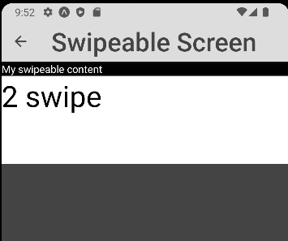

### Lab 5 - Obsługa gestów użytkownika

Do wykonania aplikacji użyte zostały:
- React Native
- Expo
- Expo go (testowanie na fizycznym urządzeniu)
- Android Studio (Emulator Pixel 3 do testów)
- Kod z poprzedniej aplikacji 

## home.js


````js
    export default function Home({navigation}) {
    return (
        <View style={styles.home.Container}>
            <TouchableOpacity style={styles.home.Button}  onPress={() => navigation.navigate('ScrollView1')} >
                <Text style={styles.home.Text}>Scroll View 1</Text>
            </TouchableOpacity>
            <TouchableOpacity style={styles.home.Button}   onPress={() => navigation.navigate('ScrollView2')} >
                <Text style={styles.home.Text}>Scroll View 2</Text>
            </TouchableOpacity>
            <TouchableOpacity style={styles.home.Button} onPress={() => navigation.navigate('TouchableScreen')} >
                <Text style={styles.home.Text}>TouchableScreen</Text>
            </TouchableOpacity>
            <TouchableOpacity style={styles.home.Button} onPress={() => navigation.navigate('SwipeScreen')} >
                <Text style={styles.home.Text}>Swipe</Text>
            </TouchableOpacity>
        </View>
    );
}
````

## scroll_view1.js


````js
export default class ScrollView1 extends Component{
    render(){
        return (
            <View style={[styles.content.container, {height: WindowHeight.height}]}>
                <View style={[styles.content.example, {height: WindowHeight.height/1.5}]} >
                    <ScrollView >
                        <View style={[styles.flexbox.box, { backgroundColor: "steelblue" }]} >
                            <Text style={styles.home.text}>
                                RedBull
                            </Text>
                        </View>
                        <View style={[styles.flexbox.box, { backgroundColor: "red" }]}>
                            <Text style={styles.home.text}>
                                Ferrari
                            </Text>
                        </View>
                        <View style={[styles.flexbox.box, { backgroundColor: "darkorange" }]} >
                            <Text style={styles.home.text}>
                                Mclaren
                            </Text>
                        </View>
                        <View style={[styles.flexbox.box, { backgroundColor: "silver" }]} >
                            <Text style={styles.home.text}>
                                Mercedes
                            </Text>
                        </View>
                        <View style={[styles.flexbox.box, { backgroundColor: "white" }]} >
                            <Text style={styles.home.text}>
                                Haas
                            </Text>
                        </View>
                        <View style={[styles.flexbox.box, { backgroundColor: "darkblue" }]}>
                            <Text style={styles.home.text}>
                                Alphatauri
                            </Text>
                        </View>
                        <View style={[styles.flexbox.box, { backgroundColor: "pink" }]}>
                            <Text style={styles.home.text}>
                                Alpine
                            </Text>
                        </View>
                        <View style={[styles.flexbox.box, { backgroundColor: "green" }]}>
                            <Text style={styles.home.text}>
                                Aston Martin
                            </Text>
                        </View>
                        <View style={[styles.flexbox.box, { backgroundColor: "skyblue" }]}>
                            <Text style={styles.home.text}>
                                Williams
                            </Text>
                        </View>
                    </ScrollView>
                </View>
            </View >
        )
    };
}
````

## scroll_view2.js


````js
export default class ScrollView2 extends Component{
    render(){
        return (
            <View style={[styles.content.example, {height: WindowHeight.height}]} >
                <ScrollViewIndicator style={styles.scrollViewIndicator} scrollViewStyle={styles.flexbox2.scrollViewStyle} scrollIndicatorContainerStyle={styles.flexbox2.scrollIndicatorContainerStyle} scrollIndicatorStyle={styles.flexbox2.scrollIndicatorStyle} >
                    <View style={[styles.flexbox2.box, { backgroundColor: "steelblue" }]} >
                        <Text style={styles.home.text}>
                            RedBull
                        </Text>
                    </View>
                    <View style={[styles.flexbox2.box, { backgroundColor: "red" }]}>
                        <Text style={styles.home.text}>
                            Ferrari
                        </Text>
                    </View>
                    <View style={[styles.flexbox2.box, { backgroundColor: "darkorange" }]} >
                        <Text style={styles.home.text}>
                            Mclaren
                        </Text>
                    </View>
                    <View style={[styles.flexbox2.box, { backgroundColor: "silver" }]} >
                        <Text style={styles.home.text}>
                            Mercedes
                        </Text>
                    </View>
                    <View style={[styles.flexbox2.box, { backgroundColor: "white" }]} >
                        <Text style={styles.home.text}>
                            Haas
                        </Text>
                    </View>
                    <View style={[styles.flexbox2.box, { backgroundColor: "darkblue" }]}>
                        <Text style={styles.home.text}>
                            Alphatauri
                        </Text>
                    </View>
                    <View style={[styles.flexbox2.box, { backgroundColor: "pink" }]}>
                        <Text style={styles.home.text}>
                            Alpine
                        </Text>
                    </View>
                    <View style={[styles.flexbox2.box, { backgroundColor: "green" }]}>
                        <Text style={styles.home.text}>
                            Aston Martin
                        </Text>
                    </View>
                    <View style={[styles.flexbox2.box, { backgroundColor: "skyblue" }]}>
                        <Text style={styles.home.text}>
                            Williams
                        </Text>
                    </View>
                </ScrollViewIndicator>
            </View>
        )
    };
}
````

## touchable.js


````js
export default class TouchableScreen extends Component {
    constructor(props) {
        super(props);
        this.state = {
            countTouchableOpacity: 0,
            countTouchableHighlight: 0,
            searchPhasese: '',
            showBrowser: false,
        };
    }

    onPressTouchableOpacity = () => {
        this.setState({
            countTouchableOpacity: this.state.countTouchableOpacity + 1
        });
    };
    onPressTouchableHighlight = () => {
        this.setState({
            countTouchableHighlight: this.state.countTouchableHighlight + 1
        });
    };
    onPressSearch = () => {
    };

    renderBrowser() {
        return (
            <Modal
                animationType="slide"
                transparent={false}
                visible={this.state.showBrowser}
                onRequestClose={() => {
                    this.setState({showBrowser: !showBrowser});
                }}
            >
                <IconButton
                    icon="close"
                    size={40}
                    onPress={() => this.setState({showBrowser: false})}
                />
                <WebView
                    source={{
                        uri: 'https://www.google.com/search?q=' + this.state.searchPhasese,
                    }}
                    onNavigationStateChange={this.onNavigationStateChange}
                    startInLoadingState
                    scalesPageToFit
                    javaScriptEnabled
                    style={{flex: 1}}
                />
            </Modal>
        );
    }

    render() {
        return (
            <View style={styles.content.container}>
                <View style={styles.content.example}>
                    <Text style={styles.home.text}>Komponenty Touchable</Text>
                </View>
                {this.state.showBrowser && this.renderBrowser()}
                <ScrollView>
                    <View style={styles.content.example}>
                        <View>
                            <View>
                                <TouchableOpacity
                                    onPress={this.onPressTouchableOpacity}
                                >
                                    <Text style={styles.home.text}>TouchableOpacity</Text>
                                </TouchableOpacity>
                            </View>
                            <View>
                                <Text>ilość kliknięć:</Text>
                                <Text> {this.state.countTouchableOpacity}</Text>
                            </View>
                        </View>
                    </View>
                    <View style={styles.content.example}>
                        <View>
                            <View>
                                <TouchableHighlight
                                    onPress={this.onPressTouchableHighlight}
                                >
                                    <Text style={styles.home.text}>TouchableHighlight</Text>
                                </TouchableHighlight>
                            </View>
                            <View>
                                <Text>ilość kliknięć:</Text>
                                <Text> {this.state.countTouchableHighlight}</Text>
                            </View>
                        </View>
                    </View>
                    <View style={styles.content.example}>
                        <View>
                            <View>
                                <Text>Webview - wyszukiwanie w Google</Text>
                                <TextInput style={styles.home.text} onEndEditing={event => {
                                    this.setState({searchPhasese: event.nativeEvent.text})
                                }}/>
                            </View>
                            <View>
                                <Button
                                    title='Wyszukaj'
                                    onPress={() => this.setState({showBrowser: true})}
                                >
                                </Button>
                            </View>
                        </View>
                    </View>
                </ScrollView>
            </View>
        )
    };
}
````

## swipe.js




````js
export default class SwipeScreen extends Component{
    state = {
        leftAction: false,
        toggle: false,
        leftAction2: false,
        toggle2: false
    };
    render() {
        const {leftAction, toggle} = this.state;
        const {leftAction2, toggle2} = this.state;
        const leftContent=[
            <View style={[styles.swipeScreen.leftSwipeItem,{backgroundColor: leftAction ? '#e00' : '#0e0'}]}>
                {leftAction ?
                    <Text>Puść!</Text> :
                    <Text>Przeciągaj dalej!</Text>}
            </View>
        ]
        const leftContent2=[
            <View style={[styles.swipeScreen2.listItem,{backgroundColor: leftAction2 ? '#e00' : '#0e0'}]}>
                {leftAction2 ?
                    <Text style={[styles.swipeScreen2.text]}>Drop!</Text> :
                    <Text style={[styles.swipeScreen2.text]}>Pull!</Text>}
            </View>
        ]

        const rightButtons = [
            <TouchableOpacity onPress={() => this.setState({toggle: !toggle})}><Text>Opcja 1</Text></TouchableOpacity>,
            <TouchableOpacity onPress={() => this.setState({toggle: !toggle})}><Text >Opcja 2</Text></TouchableOpacity>
        ];
        const rightButtons2 = [
            <TouchableOpacity onPress={() => this.setState({toggle2: !toggle2})}><Text>Edit</Text></TouchableOpacity>,
            <TouchableOpacity onPress={() => this.setState({toggle2: !toggle2})}><Text>Delete</Text></TouchableOpacity>
        ];
        return (
            <ScrollView>
                <ScrollView onScroll={this.handleScroll} >
                    <Swipeable leftActionActivationDistance={180} leftContent={leftContent} rightButtons={rightButtons} onLeftActionActivate={() => this.setState({leftAction: true})} onLeftActionDeactivate={() => this.setState({leftAction: false})} onLeftActionComplete={() => this.setState({toggle: !toggle})}>
                        <Text style={[{backgroundColor: toggle ? '#fff' : '#000', color: toggle ? '#000' : '#fff'}]}>My swipeable content</Text>
                    </Swipeable>
                    <Swipeable leftActionActivationDistance={270} leftContent={leftContent2} rightButtons={rightButtons2} onLeftActionActivate={() => this.setState({leftAction2: true})} onLeftActionDeactivate={() => this.setState({leftAction2: false})} onLeftActionComplete={() => this.setState({toggle2: !toggle2})}>
                        <Text style={[styles.swipeScreen2.listItem, {backgroundColor: toggle2 ? '#fff' : '#000', color: toggle2 ? '#000' : '#fff'}]}>2 swipe</Text>
                    </Swipeable>
                </ScrollView>
            </ScrollView>
        );
    }
}
````
