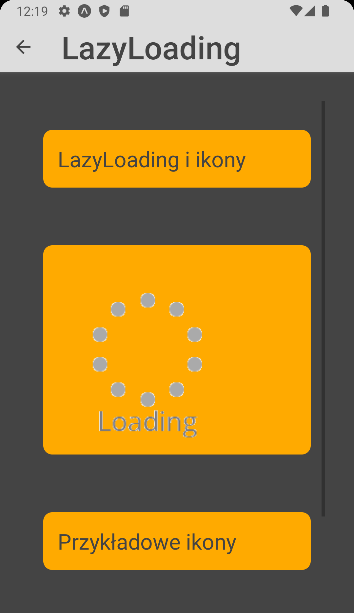
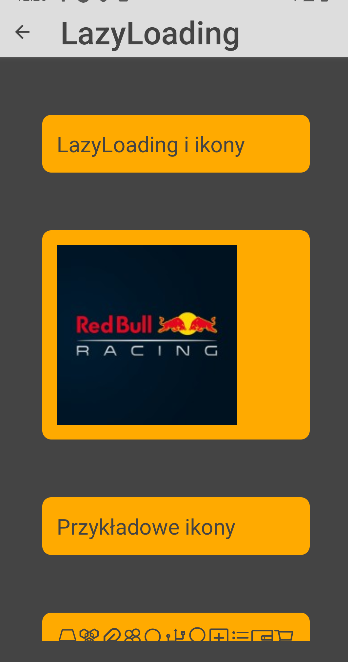
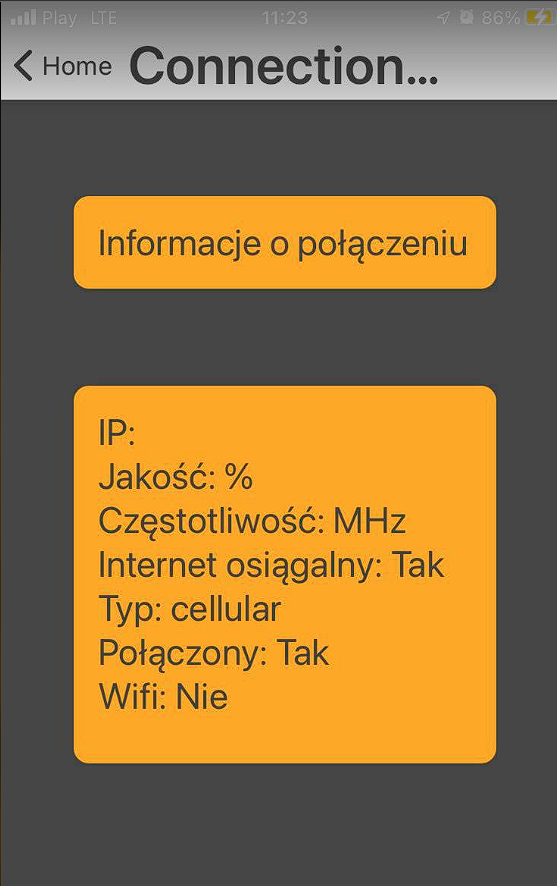

### Lab 6 - Obsługa obrazów + tryb offline

Do wykonania aplikacji użyte zostały:
- React Native
- Expo
- Expo go (testowanie na fizycznym urządzeniu)
- Android Studio (Emulator Pixel 3 do testów)
- Kod z poprzedniej aplikacji 

## home.js


````js
    export default function Home({navigation}) {
    return (
        <View style={styles.home.Container}>
            <TouchableOpacity style={styles.home.Button}   onPress={() => navigation.navigate('Slider')} >
                <Text style={styles.home.Text}>Slider</Text>
            </TouchableOpacity>
            <TouchableOpacity style={styles.home.Button} onPress={() => navigation.navigate('LazyLoading')} >
                <Text style={styles.home.Text}>LazyLoading</Text>
            </TouchableOpacity>
            <TouchableOpacity style={styles.home.Button} onPress={() => navigation.navigate('ConnectionCheck')} >
                <Text style={styles.home.Text}>ConnectionCheck</Text>
            </TouchableOpacity>
            <TouchableOpacity style={styles.home.Button} onPress={() => navigation.navigate('AsyncStorageComponent')} >
                <Text style={styles.home.Text}>Async Storage Component</Text>
            </TouchableOpacity>
            <TouchableOpacity style={styles.home.Button} onPress={() => navigation.navigate('SyncData')} >
                <Text style={styles.home.Text}>SyncData</Text>
            </TouchableOpacity>
        </View>
    );
}
````

## slider.js


````js
export default class SlideComponent extends Component {
    state = {
        imageScale: 0.5
    }
    imageResize = (value) => {
        this.setState({imageScale: value});
    }
    render(){
        return (
            <ScrollViewIndicator>
                <View style={styles.content.container}>
                    <View style={styles.content.example}>
                        <Text style={styles.home.text}>Obraz załadowany poprzez 'require' i zmiana rozmiaru</Text>
                    </View>
                    <ScrollView contentContainerStyle={[{flex:1,flexDirection: 'column'}]}>
                        <View style={styles.content.example}>
                            <Slider
                                style={{width: 275, height: 40}}
                                value={0.5}
                                minimumValue={0}
                                maximumValue={1}
                                thumbTintColor='#444'
                                minimumTrackTintColor="#444"
                                maximumTrackTintColor="#000000"
                                onValueChange={this.imageResize}
                            />
                            <Image source={require('../assets/favicon.png')} style={[{transform: [{ scale: this.state.imageScale }]}]}/>
                        </View>
                        <View style={styles.content.example}>
                            <Text style={styles.home.text}>Obraz załadowany poprzez 'uri'</Text>
                        </View>
                        <View style={styles.content.example} >
                            <Image style={{width: 200, height: 200}} source={{uri: 'https://png.pngtree.com/png-clipart/20200224/original/pngtree-qr-code-vector-hidden-text-or-url-scanning-smartphone-technology-isolated-png-image_5204763.jpg',}}  />
                        </View>
                    </ScrollView>
                </View>
            </ScrollViewIndicator>
        )
    };
}
````

## lazy_loading.js





````js
export default class LazyLoading extends Component {

    render(){
        return (
            <View style={styles.content.container}>
                <ScrollView>
                    <View style={styles.content.example}>
                        <Text style={styles.home.text}>LazyLoading i ikony</Text>
                    </View>
                    <View >
                        <View style={styles.content.example}>
                            <Image loadingIndicatorSource={loader} style={{width: 200, height: 200}} source={{uri: 'https://media.licdn.cn/dms/image/C4D0BAQFRz23u97MEpA/company-logo_200_200/0/1634035034869?e=2159024400&v=beta&t=2hXscnMkwrYNRDd-zWYJU5wQOjMdXpsRINtrv50pWuE',}} progressiveRenderingEnabled={false}/>
                        </View>
                    </View>
                    <View style={styles.content.example}>
                        <Text style={styles.home.text}>Przykładowe ikony</Text>
                    </View>
                    <View style={[styles.content.example]}>
                        <ScrollView contentContainerStyle={[{flex:1,flexDirection: 'row'}]}>

                            <View loadingIndicatorSource={loader} >
                                <AntDesign name="hdd" size={24} color="#444" />
                                <AntDesign name="ie" size={24} color="#444" />
                                <Feather name="delete" size={24} color="#444" />
                                <AntDesign name="pushpino" size={24} color="#444" />
                                <AntDesign name="hearto" size={24} color="#444" />
                                <AntDesign name="calculator" size={24} color="#444" />
                                <Feather name="chrome" size={24} color="#444" />
                                <Feather name="github" size={24} color="#444" />
                                <AntDesign name="piechart" size={24} color="#444" />

                            </View>
                            <View >
                                <AntDesign name="API" size={24} color="#444" />
                                <AntDesign name="fork" size={24} color="#444" />
                                <AntDesign name="contacts" size={24} color="#444" />
                                <AntDesign name="edit" size={24} color="#444" />
                                <AntDesign name="warning" size={24} color="#444" />
                                <AntDesign name="table" size={24} color="#444" />
                                <AntDesign name="dashboard" size={24} color="#444" />
                                <AntDesign name="google" size={24} color="#444" />
                                <AntDesign name="dropbox" size={24} color="#444" />

                            </View>
                            <View >
                                <Feather name="feather" size={24} color="#444" />
                                <Feather name="loader" size={24} color="#444" />
                                <Feather name="lock" size={24} color="#444" />
                                <Feather name="map" size={24} color="#444" />
                                <Feather name="map-pin" size={24} color="#444" />
                                <Feather name="monitor" size={24} color="#444" />
                                <Feather name="moon" size={24} color="#444" />
                                <Feather name="music" size={24} color="#444" />
                                <Feather name="phone" size={24} color="#444" />

                            </View>
                            <View >
                                <AntDesign name="team" size={24} color="#444" />
                                <AntDesign name="sharealt" size={24} color="#444" />
                                <Feather name="settings" size={24} color="#444" />
                                <AntDesign name="picture" size={24} color="#444" />
                                <Feather name="inbox" size={24} color="#444" />
                                <AntDesign name="cloudo" size={24} color="#444" />
                                <AntDesign name="tagso" size={24} color="#444" />
                                <AntDesign name="enviromento" size={24} color="#444" />
                                <AntDesign name="eyeo" size={24} color="#444" />
                            </View>
                            <View >
                                <AntDesign name="search1" size={24} color="#444" />
                                <Feather name="calendar" size={24} color="#444" />
                                <AntDesign name="dingding" size={24} color="#444" />
                                <AntDesign name="mobile1" size={24} color="#444" />
                                <AntDesign name="bells" size={24} color="#444" />
                                <AntDesign name="database" size={24} color="#444" />
                                <AntDesign name="barcode" size={24} color="#444" />
                                <AntDesign name="hourglass" size={24} color="#444" />
                                <AntDesign name="key" size={24} color="#444" />

                            </View>
                            <View >
                                <AntDesign name="USB" size={24} color="#444" />
                                <AntDesign name="skin" size={24} color="#444" />
                                <AntDesign name="car" size={24} color="#444" />
                                <AntDesign name="tool" size={24} color="#444" />
                                <AntDesign name="isv" size={24} color="#444" />
                                <AntDesign name="gift" size={24} color="#444" />
                                <AntDesign name="idcard" size={24} color="#444" />
                                <AntDesign name="rest" size={24} color="#444" />
                                <AntDesign name="Safety" size={24} color="#444" />

                            </View>
                            <View >
                                <AntDesign name="bulb1" size={24} color="#444" />
                                <AntDesign name="rocket1" size={24} color="#444" />
                                <AntDesign name="apple-o" size={24} color="#444" />
                                <AntDesign name="android" size={24} color="#444" />
                                <AntDesign name="poweroff" size={24} color="#444" />
                                <AntDesign name="find" size={24} color="#444" />
                                <AntDesign name="sound" size={24} color="#444" />
                                <AntDesign name="earth" size={24} color="#444" />
                                <AntDesign name="wifi" size={24} color="#444" />

                            </View>
                            <View >
                                <AntDesign name="plussquareo" size={24} color="#444" />
                                <Feather name="mail" size={24} color="#444" />
                                <Feather name="link" size={24} color="#444" />
                                <AntDesign name="linechart" size={24} color="#444" />
                                <Feather name="home" size={24} color="#444" />
                                <AntDesign name="laptop" size={24} color="#444" />
                                <AntDesign name="staro" size={24} color="#444" />
                                <Feather name="filter" size={24} color="#444" />
                                <Feather name="meh" size={24} color="#444" />
                            </View>
                            <View >
                                <AntDesign name="bars" size={24} color="#444" />
                                <AntDesign name="clockcircleo" size={24} color="#444" />
                                <AntDesign name="swap" size={24} color="#444" />
                                <AntDesign name="HTML" size={24} color="#444" />
                                <AntDesign name="slack" size={24} color="#444" />
                                <Entypo name="baidu" size={24} color="#444" />
                                <AntDesign name="sync" size={24} color="#444" />
                                <AntDesign name="message1" size={24} color="#444" />
                                <AntDesign name="shake" size={24} color="#444" />
                            </View>
                            <View >
                                <AntDesign name="wallet" size={24} color="#444" />
                                <AntDesign name="Trophy" size={24} color="#444" />
                                <AntDesign name="like2" size={24} color="#444" />
                                <AntDesign name="flag" size={24} color="#444" />
                                <AntDesign name="layout" size={24} color="#444" />
                                <AntDesign name="printer" size={24} color="#444" />
                                <AntDesign name="codesquare" size={24} color="#444" />
                                <AntDesign name="file1" size={24} color="#444" />
                                <AntDesign name="folder1" size={24} color="#444" />
                            </View>
                            <View >
                                <AntDesign name="shoppingcart" size={24} color="#444" />
                                <Feather name="user" size={24} color="#444" />
                                <AntDesign name="videocamera" size={24} color="#444" />
                                <AntDesign name="camerao" size={24} color="#444" />
                                <AntDesign name="windows" size={24} color="#444" />
                                <AntDesign name="export" size={24} color="#444" />
                                <AntDesign name="notification" size={24} color="#444" />
                                <AntDesign name="qrcode" size={24} color="#444" />
                                <AntDesign name="smileo" size={24} color="#444" />
                            </View>
                        </ScrollView>
                    </View>
                </ScrollView>
            </View>
        )
    };
}
````

## connection_check.js


### Sprawdzenie na urządzeniu fizycznym
#### Połaczenie wifi


#### Połaczenie LTE


#### Brak połaczenia


````js
export default class ConnectionCheck extends Component {
    state = {};
    componentDidMount() {
        this.fetchState();
    }
    fetchState = async () => {
        const state = await NetInfo.fetch();
        var tempState = JSON.stringify(state)
        this.setState(JSON.parse(tempState))
    };

    render(){
        var details = this.state.details ? JSON.parse(JSON.stringify(this.state.details,null)) : ''
        return (
            <View style={styles.content.container}>
                <View style={styles.content.example}>
                    <Text style={styles.home.text}>Informacje o połączeniu</Text>
                </View>
                <ScrollView >
                    <View style={styles.content.example}>
                        <Text style={styles.home.text}>IP: {details.ipAddress}</Text>
                        <Text style={styles.home.text}>Jakość: {details.strength}%</Text>
                        <Text style={styles.home.text}>Częstotliwość: {details.frequency}MHz</Text>
                        <Text style={styles.home.text}>Internet osiągalny: {this.state.isInternetReachable?`Tak`:`Nie`}</Text>
                        <Text style={styles.home.text}>Typ: {this.state.type}</Text>
                        <Text style={styles.home.text}>Połączony: {this.state.isConnected?`Tak`:`Nie`}</Text>
                        <Text style={styles.home.text}>Wifi: {this.state.isWifiEnabled?`Tak`:`Nie`}</Text>
                        <Text/>
                    </View>
                </ScrollView>
            </View>
        )
    };
}
````

## async_storage_component.js


````js
export default class AsyncStorageComponent extends Component {
    constructor(){
        super()
    }
    state = {
        saveKey:'',
        saveValue:'',
        readKey:''
    }
    save = async () => {
        var key = this.state.saveKey
        var value = this.state.saveValue
        await AsyncStorage.setItem(key,value);
        alert(key + ' zapisano jako ' + value)
    };
    open = async () => {
        var key = this.state.readKey
        const value = await AsyncStorage.getItem(key);
        if (value !== null) {
            alert('Klucz:'+ key +' Wartość:'+ value);
        }else{
            alert('Nie znaleziono elementu');
        }
    };
    render(){
        return (
            <View style={styles.content.container}>
                <ScrollView >
                    <View >
                        <View style={styles.content.example} >
                            <Text style={styles.home.Text}>Wpisz klucz jaki chcesz zapisać pod daną wartością</Text>
                            <View style={{flexDirection: 'row'}}>
                                <Text style={styles.home.text}>Klucz:</Text>
                                <TextInput style={styles.home.text} onEndEditing={event =>{this.setState({saveKey: event.nativeEvent.text})}} placeholder="Podaj klucz" />
                            </View>
                            <View style={{flexDirection: 'row'}}>
                                <Text style={styles.home.text}>Wartosc:</Text>
                                <TextInput style={styles.home.text} onEndEditing={event =>{this.setState({saveValue: event.nativeEvent.text})}} placeholder="Wpisz wartość" />
                            </View>
                            <Button
                                title='Zapisz'
                                onPress={this.save}
                            >
                            </Button>
                        </View>
                    </View>
                    <View >
                        <View style={styles.content.example}>
                            <Text style={styles.home.text}>Podaj wartość klucza od odczytania</Text>
                            <View style={{flexDirection: 'row'}}>
                                <Text style={styles.home.text}>Klucz:</Text>
                                <TextInput style={styles.home.text} onEndEditing={event =>{this.setState({readKey: event.nativeEvent.text})}} placeholder="Podaj klucz" />
                            </View>
                            <Button
                            title='Odczytaj'
                            onPress={this.open}
                            />
                        </View>
                    </View>
                </ScrollView>
            </View>
        )
    };
}
````

## sync_data.js


````js
export default class SyncData extends Component {
    sliderValue = async (value) => {
        var key = "localValue"
        try {
            await AsyncStorage.setItem(key,value.toString());
        } catch (error) {
            console.error(error)
        }
        try {
            const tempValue = await AsyncStorage.getItem(key);
            if (tempValue !== null) {
                this.setState({localValue:tempValue})
            }else{
                this.setState({localValue:'n/a'})
            }
        } catch (error) {
            this.setState({localValue:error})
        }
    }
    state = {
        internetConnection: true,
        localValue:'',
        remoteValue:'',
    }
    checkData = () =>{
        if(this.state.internetConnection){
            this.setState({remoteValue:this.state.localValue})
        }else{

        }
    }
    componentDidMount(){
        setInterval(this.checkData, 1000)
    }
    render(){
        return (
            <View style={styles.content.container}>
                <ScrollView >
                    <View style={styles.content.example}>
                        <Text >{this.state.internetConnection?`Połączono z internetem `:`Brak połączenia z internetem`}</Text>
                        <Switch value={this.state.internetConnection} onValueChange={val =>{this.setState({ internetConnection: val})}}/>
                    </View>
                    <View style={styles.content.example}>
                        <View >
                            <Text style={styles.home.text}>Zmiana danych </Text>
                            <View style={{alignItems: 'center', marginTop: 10,}}>
                                <NumericInput
                                    onChange={this.sliderValue}
                                    onLimitReached={(isMax,msg) => console.log(isMax,msg)}
                                    totalWidth={240}
                                    totalHeight={50}
                                    iconSize={25}
                                    valueType='real'
                                    rounded
                                    textColor='#000'
                                    borderColor= '#666'
                                    iconStyle={{ color: 'white' }}
                                    rightButtonBackgroundColor='#4f4'
                                    leftButtonBackgroundColor='#0d0'/>
                            </View>
                        </View>
                    </View>
                    <View style={styles.content.example}>
                        <Text style={styles.home.text}>Podgląd </Text>
                        <View >
                            <View >
                                <Text >Dane lokalnie</Text>
                                <Text >{this.state.localValue}</Text>
                            </View>
                            <View >
                                <Text >Dane zdalne</Text>
                                <Text >{this.state.remoteValue}</Text>
                            </View>
                        </View>
                    </View>
                </ScrollView>
            </View>
        )
    };
}
````